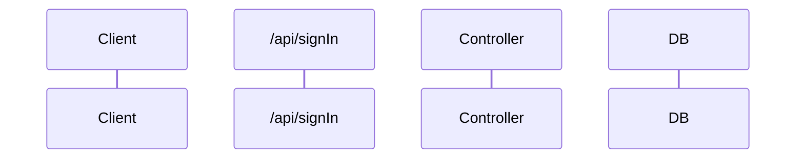

### Required env

- `RSA_PRIVATE_KEY`(*Required*): String of the private key in pkcs8 type with pem format or the path to a .pem file
- `RSA_KEY_PASSPHRASE`(*Required*): Passphrase of the private key
- `APP_NAME`(*Required*): Display name for the application
- `ON_SIGN_IN_URL`(*Required*): URL to go after a successful sign in. JWT is passed as a parameter
- `DB_COLLECTION`(*Required*): Mongo collection of the accounts
- `DB_DATABASE`(*Required*): Mongo database
- `DB_HOST`(*Required*): Mongo database host
- `DB_PORT`: Mongo database host port
- `DB_PASSWORD`(*Required*): Mongo database username
- `DB_USERNAME`(*Required*): Mongo database password
- `NEXT_PUBLIC_DEV_AUTOFILL`: If this variable is set with `"true"`, the inputs will auto fill. (Only works in non prod environments)

### Flows

#### Sign In

